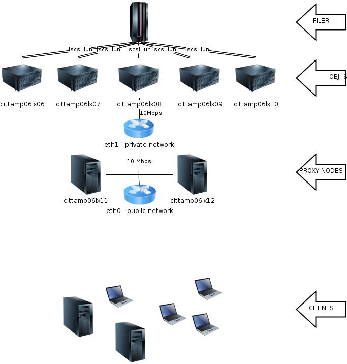

.. |reST| replace:: reStructuredText
.. |Python| replace:: Python, *the* best language around
.. _Python: http://www.python.org/

.. header:: This space for rent.
   HEADER

.. footer:: Footer text
   FOOTER

.. comment dude

Hardware Utilizado
==================

# Object-writer nodes

  * 6x ProLiant BL460c G6  
     * 2x 10Gbps Nic
     * 2x 300GB 10KRpm SAS HDD
     * 24GB RAM
     * 24 CPUs Xeon(R) L5640 @ 2.27GHz

  * 6x 10GB iSCSI LUNs 
     * NetAPP Filer 

# Proxy nodes
  * 2x ProLiant BL460c G6
     * 2x 10Gbps Nic
     * 2x 300GB 10KRpm SAS HDD
     * 24GB RAM
     * 24 CPUs Xeon(R) L5640 @ 2.27GHz

.. include:: etc/swift.conf
   :start-line: 0
   :end-line: 0

.. epigraph::

   No matter where you go, there you are.

   -- Buckaroo Banzai
